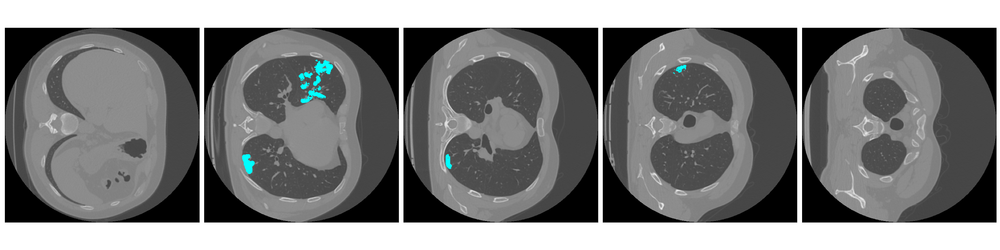

## covid_segmentation

*Visualisation of dataset, containing ~1.6k labeled images*

# Description of the project

This is a kaggle competition, given as a homework at Tinkoff courses. The task was to use any models (2d, 3d convolution neural networks) for achieving high results at leaderboard.

# Used technologies
- No augmentation
- Tversky loss
- etc.

# Results
16/11 - dice loss at public test 60
20.11 - dice loss at public test 62.9

Download data:
- `cd data/raw`
- `kaggle competitions download -c tgcovid`
- `unzip tgcovid.zip`

Preprocess data:
- `mkdir data/preprocessed`
- run `visualize.ipynb`

Install packages for the project: `pip install -r requirements.txt`

